class: inverse, center, middle

# Git != GitHub

---

# Git != GitHub 

 

.pull-left[
   
Git is a "free and open source distributed **version control system**" and mostly interfaced via the command line.  
  
]

.pull-right[
    
GitHub is a website that **hosts Git repositories** (i.e. your code). You upload your code to GitHub and allows you to colloborate with others. GitHub is private company - owned by Microsoft.
]

---
class: center, inverse

# What is it?

  
[Source](https://xkcd.com/1597/)

---
class: center, inverse

# Why do you care?

  
[Source](http://phdcomics.com/comics/archive_print.php?comicid=1531)

---
class: center, inverse

# What else is GitHub good for?

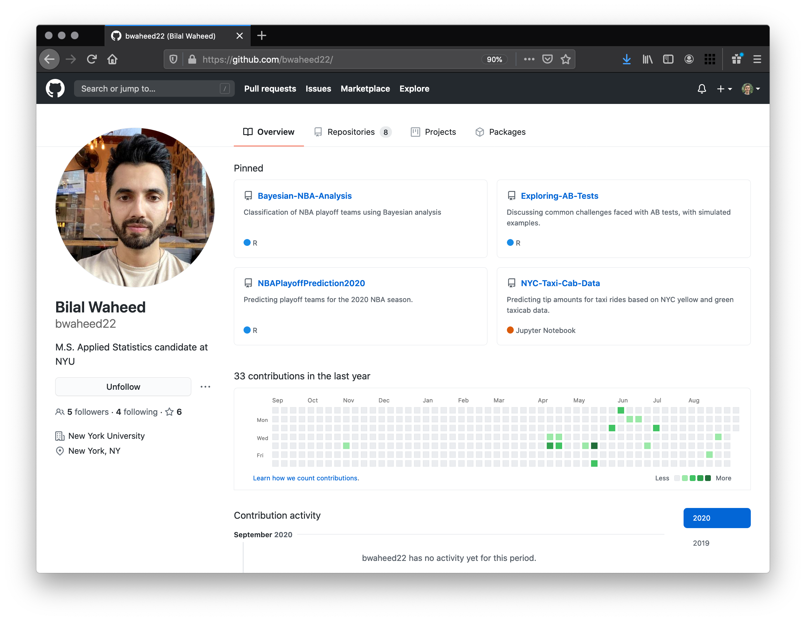  

---
class: center, inverse

# What else is GitHub good for?

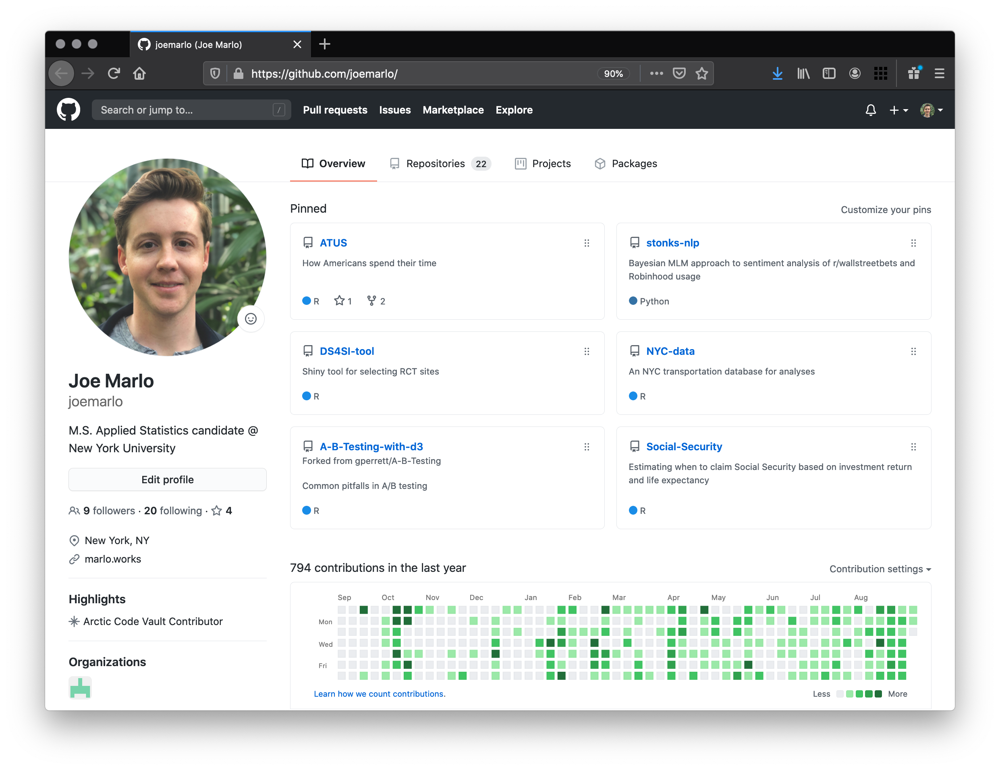  

---
class: center, inverse

# What else is GitHub good for?

  

---
class: center, inverse

# Why use GitHub?

  

Because almost everyone else does.

  

<a href="https://about.gitlab.com/">GitLab</a> and <a href="https://bitbucket.org/product/">BitBucket</a> are also commonly used but, in my experience, mostly internally by organizations.

---
# Git basics and workflow

   
- ## Git structure   
- ## The three states of git   
- ## Doing everything through Rstudio Projects

---
# Git structure basics

- ### Git maintains a tree that tracks changes over time via branches 
- ### Each node is a snapshot in time of the repository (i.e. all the files in your project) 
- ### Each branch represents a different offshoot of the repository — which can be later merged to the master branch  

---
class: center, inverse
# Git structure examples

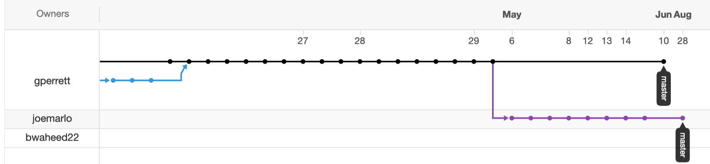

---
# The three states of git

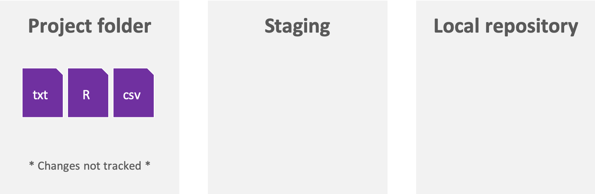

---
# The three states of git

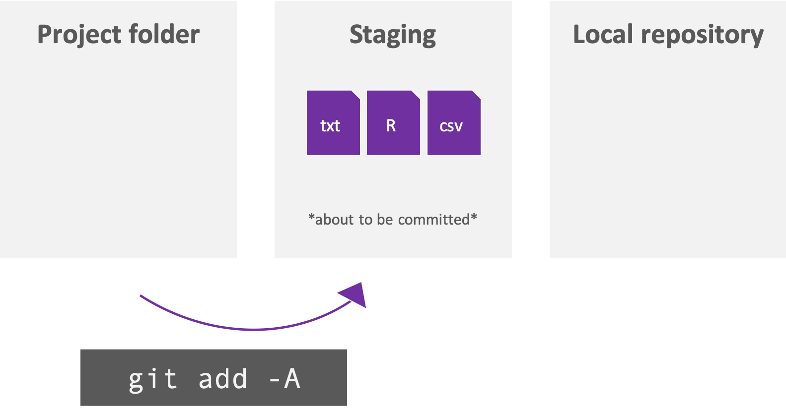

---
# The three states of git

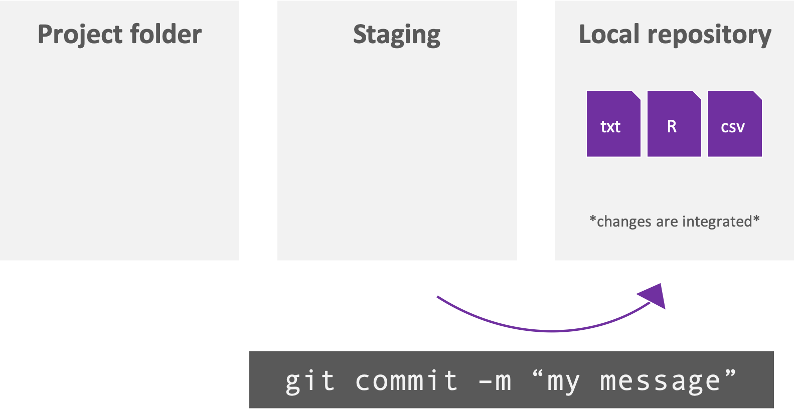

---
# Plus one state of GitHub

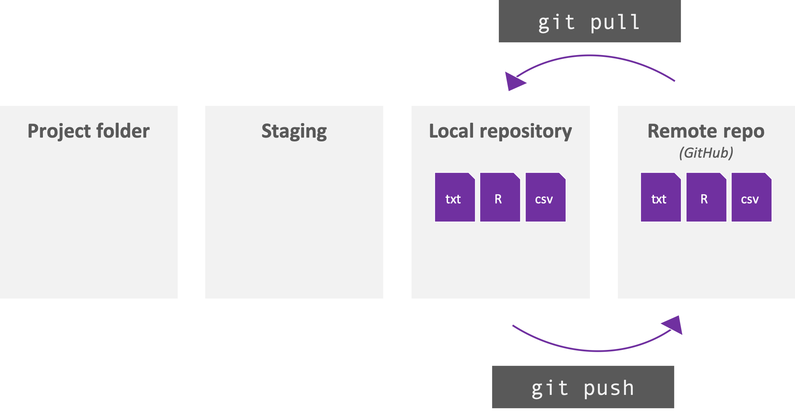

---
# Git + GitHub + Rstudio Projects:  your magical trio 

 

- ### 99% of your Git tasks can likely be accomplished through Rstudio using <a href="https://support.rstudio.com/hc/en-us/articles/200526207-Using-Projects">Rstudio Projects</a> 
- ### Rstudio provides a UI so the previous terminal commands are not necessary  
- ### The full workflow can be accomplished via the following 

---
# Git + GitHub + Rstudio Projects: your magical trio 

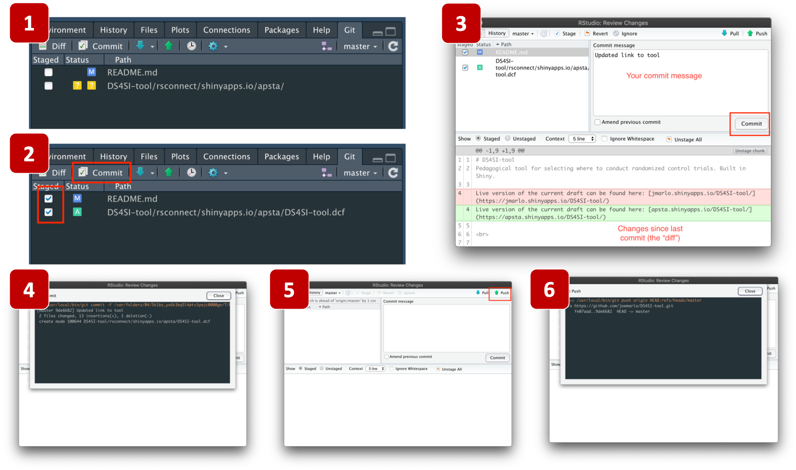

---
# Setting up a new repository

<h2>First, create a new repo on Github</h2>
 

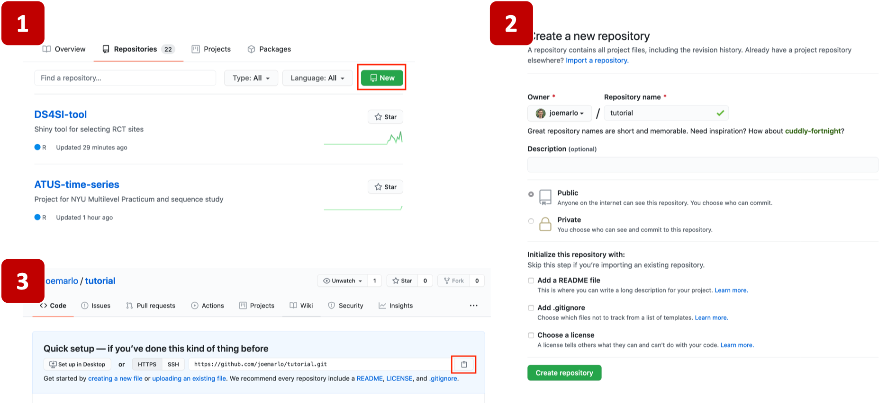

---
# Setting up a new repository

<h2>Second, clone the repo to your machine using Rstudio Projects</h2>
 

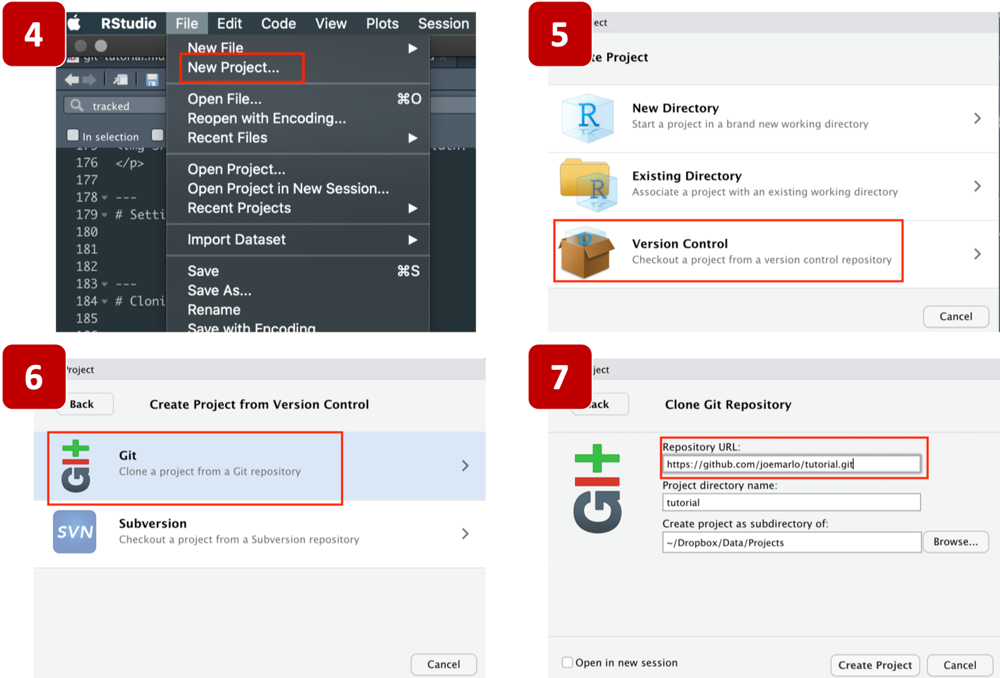

---
# Other good things to know 

 
- ### Always pull before pushing  
- ### You can put **anything** in your git repo — so be careful  
- ### GitHub will reject files larger than 100mb — if you commit a large file and then remove it, GitHub will still reject it because the file is still in the repo history  
- ### README is a text file that describes your repository/project. This is a great place for a description of the project, documentation, and attributions  
- ### You can make your repo private on GitHub so no one else can see it   

---
# .gitignore

- By default, `git add -A` adds everything in your directory to the repo
- Sometimes you don't want to track everything. E.g. uploading a 1gb csv to GitHub
- .gitignore is a text file in the repo's parent directory. Any items added to it are excluded from the repo.

.pull-left[

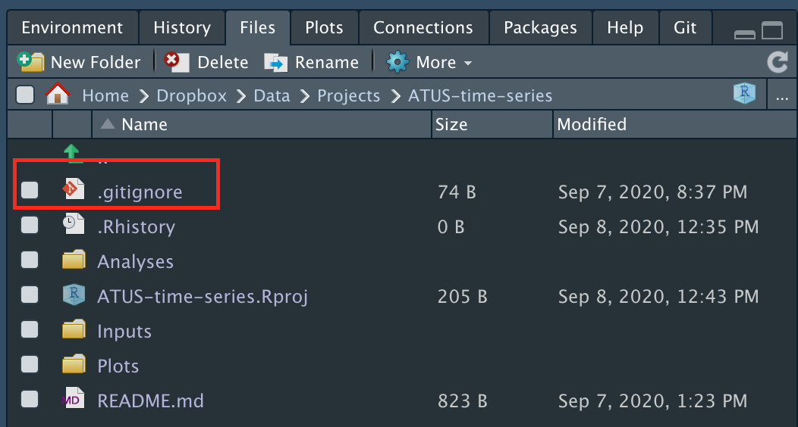

]

.pull-right[

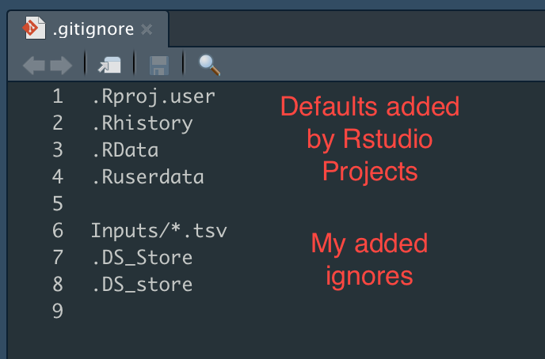

- regex can be used to exclude mulitple files
- e.g. `Inputs/*.tsv` excludes all tsv files in the `Inputs` sub-folder
]

---
# Adding colloborators to your repo

 

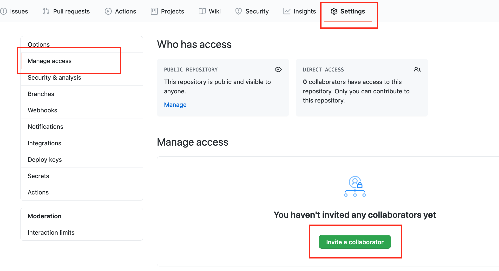

---
# Common issues and how to fix

.pull-left[
### The issue
- You committed a large file (e.g. 500mb CSV) and then pushed it to GitHub 
- GitHub rejected it because its over the limit of ~100mb
- You remove it from your repo and commit again. GitHub still rejects because the file is in your branch so you're still uploading it  

### The fix
- Roll back your commits 
- First use `git reset --soft HEAD~2` to roll back two commits. This won't roll back the files, just the commit (use `--hard` for that)
- Now remove the large file from the repo (or use .gitignore) then add commit push
- You can also view your past commits via `git log`
]

.pull-right[
### The issue
- Somehow the remote repo changed and you can't push to GitHub

### The fix
- `git remote -v` to see where the remote repo lives
- if this returns something like `git@github-nyu:nyu-stats-club/nyu-stats-club.github.io.git` then its an SSH repo
- instead if it returns something like `https://github.com/joemarlo/ATUS-time-series.git` then its a HTTPS repo
- Changing the remote will **likely** fix your issue. Use `git remote set-url origin` followed by your remote's HTTPS link. That link is on your GitHub repo's page: find the green 'Code' button and c/p the link
]

---
# Additional resources

We didn't talk about:
- `git merge`
- `git checkout`
- `git fetch`
- `git clone`
- `git diff`
- `fork`

So here are some great additional resources: 
- [NYU Data Services git guide](https://nyu-dataservices.github.io/Intro-Git-GitHub/#/)
- [PRIISM guide to GitHub](https://github.com/priism-center/stats-club/tree/master/GitHub-Basics)
- [Git the simple guide](https://rogerdudler.github.io/git-guide/)
- [15 minute tutorial to learn git](https://try.github.io/)
- [RStudio Projects](https://support.rstudio.com/hc/en-us/articles/200526207-Using-Projects)
- [Forking and pull request](https://gist.github.com/Chaser324/ce0505fbed06b947d962)

