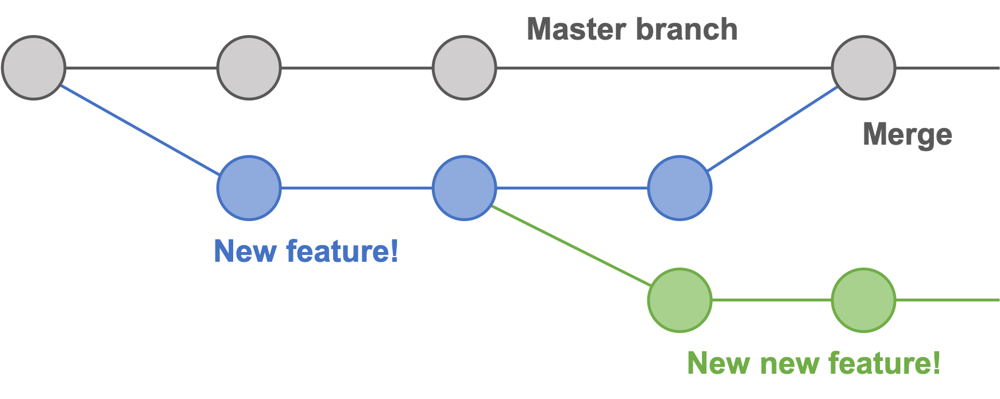
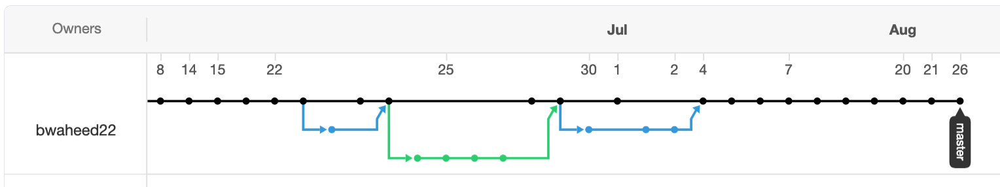

class: inverse, center, middle

# Git != GitHub

---

# Git != GitHub 

 

.pull-left[
   
Git is a "free and open source distributed **version control system**" and mostly interfaced via the command line.  
  
]

.pull-right[
    
GitHub is a website that **hosts Git repositories** (i.e. your code). You upload your code to GitHub and allows you to colloborate with others. GitHub is private company - owned by Microsoft.
]

---
class: center, inverse

# What is it?

  
[Source](https://xkcd.com/1597/)

---
class: center, inverse

# Why do you care?

  
[Source](http://phdcomics.com/comics/archive_print.php?comicid=1531)

---
class: center, inverse

# What else is GitHub good for?

  

---
class: center, inverse

# What else is GitHub good for?

  

---
class: center, inverse

# What else is GitHub good for?

  

---
class: center, inverse

# Why use GitHub?

  

Because almost everyone else does.

  

<a href="https://about.gitlab.com/">GitLab</a> and <a href="https://bitbucket.org/product/">BitBucket</a> are also commonly used but, in my experience, mostly internally by organizations.

---
# Git basics and workflow

   
<h2>
- Git structure   
- The three states of git   
- Doing everything through Rstudio Projects
</h2>

---
# Git structure basics

<h3>
- Git maintains a tree that tracks changes over time via branches  
- Each node is a snapshot in time of the repository (i.e. all the files in your project)  
- Each branch represents a different offshoot of the repository  
  -  which can be later merged to the master branch  
</h3>

 

---
class: center, inverse
# Git structure examples

---
# The three states of git

---
# The three states of git

---
# The three states of git

---
# Plus one states of GitHub

---
# Git + GitHub + Rstudio Projects: your magical trio 

 
<h3>
- 99% of your Git tasks can likely be accomplished through Rstudio using <a href="https://support.rstudio.com/hc/en-us/articles/200526207-Using-Projects">Rstudio Projects</a> 
    
- Rstudio provides a UI so the previous terminal commands are not necessary  
    
- The full workflow can be accomplished via the following 
</h3>

---
# Git + GitHub + Rstudio Projects: your magical trio 

---
# Setting up a new repository

<h2>First, create a new repo on Github</h2>
 

---
# Setting up a new repository

<h2>Second, clone the repo to your machine using Rstudio Projects</h2>
 

---
# Other good things to know 

 
<h3>
- Always pull before pushing  
- You can put **anything** in your git repo  
- GitHub will reject files larger than 100mb -> if you commit a large file and then remove it, GitHub will still reject it b/c the file is still in the repo history  
- README is a text file that describes your repository/project. This is a great place for a description of the project, documentation, and attributions  
</h3>

---
# .gitignore

- By default, `git add -A` adds everything in your directory to the repo
- Sometimes you don't want to track everything. E.g. uploading a 1gb csv to GitHub
- .gitignore is a text file in the repo's parent directory. Any items added to it are excluded from the repo.

.pull-left[

]

.pull-right[

- regex can be used to exclude mulitple files
- e.g. `Inputs/*.tsv` excludes all tsv files in the `Inputs` sub-folder
]

---
# Adding colloborators to your repo

 

---
# Additional resources

We didn't talk about:
- `git merge`
- `git checkout`
- `git fetch`
- `git reset`
- `get log`
- `git remote`
- `git clone`
- `fork`

So here are some great additional resources: 
- [NYU Data Services git guide](https://nyu-dataservices.github.io/Intro-Git-GitHub/#/)
- [PRIISM guide to GitHub](https://github.com/priism-center/stats-club/tree/master/GitHub-Basics)
- [Git the simple guide](https://rogerdudler.github.io/git-guide/)
- [15 minute tutorial to learn git](https://try.github.io/)
- [RStudio Projects](https://support.rstudio.com/hc/en-us/articles/200526207-Using-Projects)

